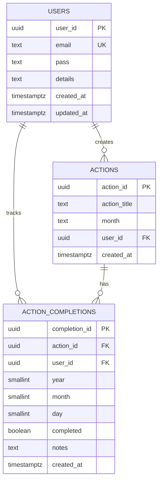
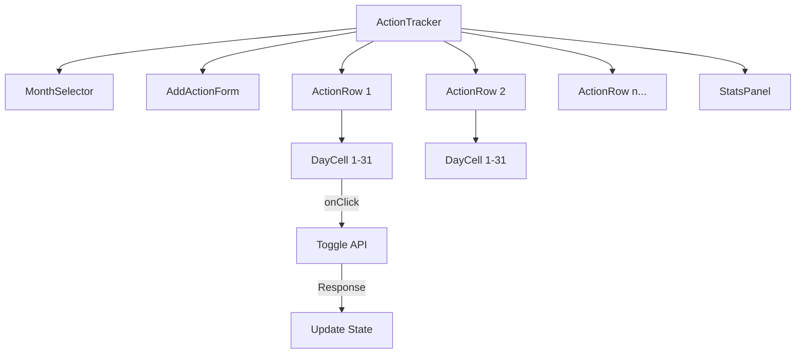

# Action Tracker - Technical Documentation

## Overview

A habit/task tracking system where users can define actions and track their daily completion across months. The UI displays actions as rows with days 1-31 as checkbox columns.

```
┌─────────────────┬────┬────┬────┬────┬────┬─────┬──────┐
│ Action          │  1 │  2 │  3 │  4 │  5 │ ... │  31  │
├─────────────────┼────┼────┼────┼────┼────┼─────┼──────┤
│ Exercise        │ ✓  │ ✓  │    │ ✓  │ ✓  │     │  ✓   │
│ Read 30 mins    │ ✓  │    │ ✓  │ ✓  │    │     │      │
│ Meditate        │ ✓  │ ✓  │ ✓  │ ✓  │ ✓  │     │  ✓   │
└─────────────────┴────┴────┴────┴────┴────┴─────┴──────┘
                        December 2024
```

---

## Database Schema

### Existing Tables

```sql
-- Users table (already exists)
CREATE TABLE public.users (
  user_id uuid PRIMARY KEY DEFAULT gen_random_uuid(),
  email text NOT NULL UNIQUE,
  pass text NOT NULL,
  details text,
  created_at timestamptz NOT NULL DEFAULT now(),
  updated_at timestamptz
);

-- Actions table (already exists)
CREATE TABLE IF NOT EXISTS public.actions (
  action_id uuid PRIMARY KEY DEFAULT gen_random_uuid(),
  action_title text NOT NULL,
  month text, 
  user_id uuid NOT NULL,
  created_at timestamptz NOT NULL DEFAULT now(),
  CONSTRAINT fk_actions_user FOREIGN KEY (user_id) 
    REFERENCES public.users(user_id) ON DELETE CASCADE
);
```

### New Table: action_completions

Tracks which days an action was completed.

```sql
CREATE TABLE IF NOT EXISTS public.action_completions (
  completion_id uuid PRIMARY KEY DEFAULT gen_random_uuid(),
  action_id uuid NOT NULL,
  user_id uuid NOT NULL,
  year smallint NOT NULL,
  month smallint NOT NULL CHECK (month BETWEEN 1 AND 12),
  day smallint NOT NULL CHECK (day BETWEEN 1 AND 31),
  completed boolean NOT NULL DEFAULT true,
  notes text,
  created_at timestamptz NOT NULL DEFAULT now(),
  
  CONSTRAINT unique_action_day UNIQUE (action_id, year, month, day)
);

-- Foreign keys
ALTER TABLE public.action_completions
  ADD CONSTRAINT fk_completions_action
  FOREIGN KEY (action_id) REFERENCES public.actions(action_id) ON DELETE CASCADE;

ALTER TABLE public.action_completions
  ADD CONSTRAINT fk_completions_user
  FOREIGN KEY (user_id) REFERENCES public.users(user_id) ON DELETE CASCADE;

-- Indexes for performance
CREATE INDEX idx_completions_user_month ON public.action_completions(user_id, year, month);
CREATE INDEX idx_completions_action_month ON public.action_completions(action_id, year, month);
CREATE INDEX idx_completions_user_year ON public.action_completions(user_id, year);
```

---

## Entity Relationship Diagram



---

## API Endpoints

### Actions

| Method | Endpoint | Description |
|--------|----------|-------------|
| GET | `/api/actions?month=12&year=2024` | Get all actions with completions for a month |
| POST | `/api/actions` | Create a new action |
| PUT | `/api/actions/:id` | Update an action title |
| DELETE | `/api/actions/:id` | Delete an action and its completions |

### Completions

| Method | Endpoint | Description |
|--------|----------|-------------|
| POST | `/api/completions/toggle` | Toggle a day's completion status |
| GET | `/api/completions/stats?year=2024` | Get yearly completion statistics |

---

## API Request/Response Examples

### Get Actions with Completions

**Request:**
```http
GET /api/actions?month=12&year=2024
Authorization: Bearer <token>
```

**Response:**
```json
{
  "success": true,
  "data": [
    {
      "action_id": "uuid-1",
      "action_title": "Exercise",
      "completions": [1, 2, 4, 5, 15, 20],
      "completion_rate": 19.35
    },
    {
      "action_id": "uuid-2",
      "action_title": "Read 30 mins",
      "completions": [1, 3, 4],
      "completion_rate": 9.68
    }
  ],
  "month": 12,
  "year": 2024,
  "days_in_month": 31
}
```

### Toggle Day Completion

**Request:**
```http
POST /api/completions/toggle
Content-Type: application/json
Authorization: Bearer <token>

{
  "action_id": "uuid-1",
  "year": 2024,
  "month": 12,
  "day": 5
}
```

**Response:**
```json
{
  "success": true,
  "completed": true,
  "message": "Day 5 marked as completed"
}
```

---

## SQL Query Examples

### Get Actions with Monthly Completions

```sql
SELECT 
  a.action_id,
  a.action_title,
  COALESCE(
    ARRAY_AGG(ac.day ORDER BY ac.day) FILTER (WHERE ac.completed = true),
    '{}'
  ) as completed_days,
  COUNT(ac.day) FILTER (WHERE ac.completed = true) as total_completed
FROM public.actions a
LEFT JOIN public.action_completions ac 
  ON a.action_id = ac.action_id 
  AND ac.year = $2 
  AND ac.month = $3
WHERE a.user_id = $1
GROUP BY a.action_id, a.action_title
ORDER BY a.created_at;
```

### Toggle Day Completion (Upsert)

```sql
INSERT INTO public.action_completions (action_id, user_id, year, month, day, completed)
VALUES ($1, $2, $3, $4, $5, true)
ON CONFLICT (action_id, year, month, day) 
DO UPDATE SET completed = NOT action_completions.completed
RETURNING completed;
```

### Get Completion Stats for a Year

```sql
SELECT 
  month,
  COUNT(DISTINCT action_id) as actions_tracked,
  COUNT(*) FILTER (WHERE completed = true) as days_completed,
  ROUND(
    COUNT(*) FILTER (WHERE completed = true) * 100.0 / 
    NULLIF(COUNT(*), 0), 2
  ) as completion_rate
FROM public.action_completions
WHERE user_id = $1 AND year = $2
GROUP BY month
ORDER BY month;
```

### Copy Actions to Next Month

Actions are reusable across months. To get actions for a new month, simply query the same actions with a different month/year filter - completions start fresh.

```sql
-- Actions persist, only completions are month-specific
-- No copying needed - just query actions and their completions for the new month
```

---

## Frontend Component Structure

```
components/
├── ActionTracker/
│   ├── ActionTracker.tsx       # Main container
│   ├── ActionRow.tsx           # Single action with day checkboxes
│   ├── DayCell.tsx             # Individual day checkbox
│   ├── MonthSelector.tsx       # Month/year navigation
│   ├── AddActionForm.tsx       # Form to add new actions
│   └── StatsPanel.tsx          # Completion statistics
```

### Component Flow



---

## Scalability Considerations

### Current Approach (Row per completion)
- **Pros:** Flexible, supports notes per day, easy to query
- **Cons:** More rows (up to 31 per action per month)
- **Best for:** < 10,000 active users

### Alternative: Bitfield Approach (For high scale)

```sql
CREATE TABLE public.action_monthly_progress (
  progress_id uuid PRIMARY KEY DEFAULT gen_random_uuid(),
  action_id uuid NOT NULL,
  user_id uuid NOT NULL,
  year smallint NOT NULL,
  month smallint NOT NULL,
  days_completed integer NOT NULL DEFAULT 0, -- Bit 0 = day 1, Bit 30 = day 31
  CONSTRAINT unique_action_month UNIQUE (action_id, year, month)
);
```

**Bitwise Operations:**
```javascript
// Check if day 5 is completed (0-indexed, so day 5 = bit 4)
const isCompleted = (days_completed >> 4) & 1;

// Toggle day 5
const newValue = days_completed ^ (1 << 4);

// Set day 5 as completed
const newValue = days_completed | (1 << 4);

// Unset day 5
const newValue = days_completed & ~(1 << 4);
```

- **Pros:** 1 row per action per month, very compact
- **Cons:** No per-day notes, harder to query individual days
- **Best for:** > 10,000 active users, mobile apps

---

## Implementation Checklist

- [ ] Create `action_completions` table migration
- [ ] Add indexes for performance
- [ ] Create API route: `GET /api/actions`
- [ ] Create API route: `POST /api/completions/toggle`
- [ ] Create API route: `GET /api/completions/stats`
- [ ] Build `ActionTracker` component
- [ ] Build `ActionRow` component with day cells
- [ ] Build `MonthSelector` for navigation
- [ ] Add optimistic UI updates for toggling
- [ ] Add completion statistics panel
- [ ] Add animations for checkbox interactions
